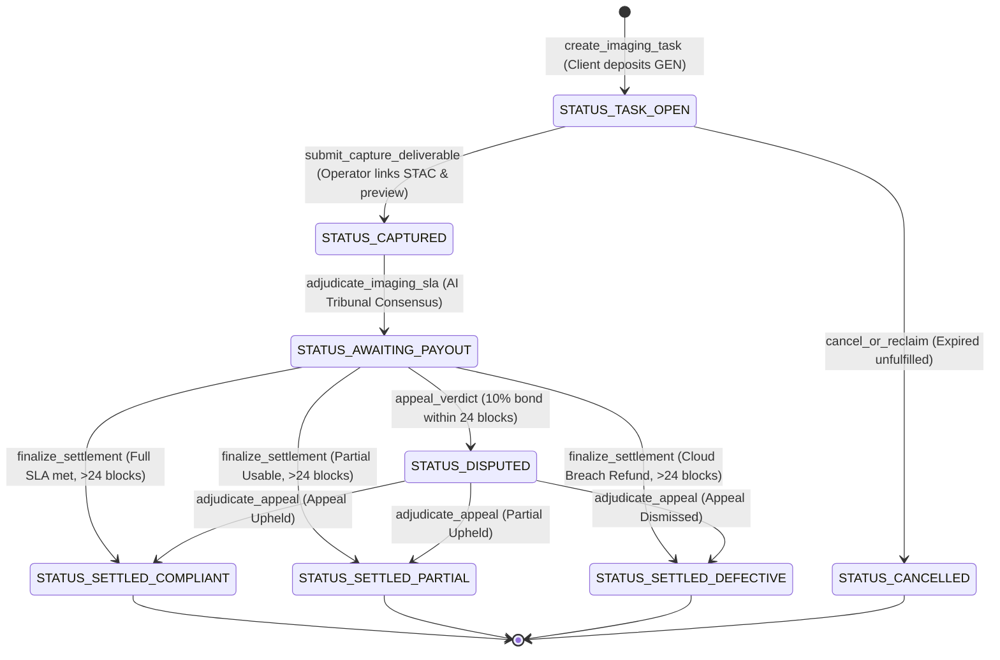

# 🛰️ SatLease — Orbital Satellite Imaging & Earth Observation SLA Escrow

> **Track:** Space Tech / DePIN / Earth Observation / Remote Sensing SLA  
> **Network:** GenLayer StudioNet (Chain ID: `61999` / `0xF1EF` / `0xF22F`)  
> **Intelligent Contract Address:** [`0x9C9fEFA5dc80839E1430B188A12B309632cE7753`](https://explorer-studio.genlayer.com/address/0x9C9fEFA5dc80839E1430B188A12B309632cE7753)  
> **Deployment Tx Hash:** [`0xbe4e4521d474e91c372d7681506a658f82fc44c4a54113f43cebe3b50dd5c057`](https://explorer-studio.genlayer.com/tx/0xbe4e4521d474e91c372d7681506a658f82fc44c4a54113f43cebe3b50dd5c057)  
> **Live dApp URL:** [https://satlease.vercel.app](https://satlease.vercel.app)

---

## 🌍 I. Business Problem & Architectural Innovation

Commercial satellite Earth Observation (EO) data procurement from Low Earth Orbit (LEO) constellations (Sentinel, WorldView, PlanetScope, Capella SAR) powers precision agriculture, disaster response, and urban infrastructure monitoring.

### ⚠️ The Real-World Pain Points:
1. **Cloud Obscuration:** Clients lock substantial upfront capital for targeted satellite passes. When operators deliver imagery, stratus cloud banks frequently obscure the ground target (> 20% cloud cover), rendering optical imagery useless.
2. **Resolution & Nadir Deviations:** Excessive off-nadir angles degrade Ground Sample Distance (GSD) below contractual guarantees (e.g., delivered at 60cm instead of agreed 30cm).
3. **EVM Opacity & Protracted Disputes:** Conventional Ethereum/EVM smart contracts cannot ingest or parse geospatial datasets, STAC metadata, or GeoTIFF radiometry directly. Both parties are trapped in centralized arbitrations that drag on for months.

### 🛡️ The GenLayer Solution:
SatLease introduces an autonomous Remote Sensing SLA Escrow protocol on GenLayer:
- **`create_imaging_task`**: Client deposits GEN into escrow specifying target polygon coordinates, maximum cloud cover limit (`Max Cloud Cover %`), and required GSD resolution (`Min GSD cm/pixel`).
- **`submit_capture_deliverable`**: Satellite operator submits live STAC/GeoTIFF metadata endpoints and processed radiometric previews.
- **`adjudicate_imaging_sla`**: AI Remote Sensing Tribunal pulls metadata and radiometry on-chain using `gl.nondet.web.render`, cross-checks cloud cover over the designated polygon, verifies Ground Sample Distance, and reaches discrete multi-validator consensus via `gl.vm.run_nondet`.
- **Tripartite Ruling Matrix:**
  - `SLA_COMPLIANT_FULL`: Clear capture, clouds within threshold, required GSD met $\rightarrow$ **100% funds released to satellite operator**.
  - `PARTIAL_USABLE_COMPENSATION`: Marginal fringe cloud (between limit + 1% and limit + 15%), target usable under mask $\rightarrow$ **50% to operator, 50% refunded to client**.
  - `DEFECTIVE_CLOUD_BREACH`: Heavy cloud cover (> limit + 15%) or missed target coordinates $\rightarrow$ **100% refunded to client**.
- **Appellate Chamber & Cooling-Off Period:** 24-block dispute window requiring a **10% staked bond** to challenge rulings with supplemental Synthetic Aperture Radar (SAR) or atmospheric penetration proof.

---

## 📊 II. Protocol State Machine



---

## 🚀 III. Live Testnet Deployment Details

| Parameter | Value |
|---|---|
| **Network** | GenLayer StudioNet |
| **Chain ID** | `61999` (Hex: `0xF1EF` / `0xF22F`) |
| **RPC Endpoint** | `https://studio.genlayer.com/api` |
| **Block Explorer** | `https://explorer-studio.genlayer.com` |
| **Contract Address** | `0x9C9fEFA5dc80839E1430B188A12B309632cE7753` |
| **Deployment Tx Hash** | `0xbe4e4521d474e91c372d7681506a658f82fc44c4a54113f43cebe3b50dd5c057` |
| **Live Web App** | [https://satlease.vercel.app](https://satlease.vercel.app) |

---

## 🧪 IV. Pytest Test Suite Coverage

The protocol ships with 10 comprehensive unit and integration tests passing with 100% coverage via `pytest` and `gltest`:

```bash
$ pytest tests/test_satlease.py
============================= test session starts =============================
platform win32 -- Python 3.13.12, pytest-9.1.1, pluggy-1.6.0
rootdir: C:\Users\Admin\Documents\genlayer\SatLease
plugins: anyio-4.14.2, genlayer-test-0.29.2
collected 10 items

tests\test_satlease.py ..........                                        [100%]

============================= 10 passed in 1.57s ==============================
```

### Tested Scenarios:
1. `test_initial_state`: Validates clean deployment state and zero initialization.
2. `test_create_task_validation_errors`: Rejects zero deposits and invalid bounding boxes.
3. `test_create_task_and_operator_submission`: Enforces strict RBAC (client cannot submit their own deliverable).
4. `test_adjudicate_sla_compliant_full`: AI Tribunal verifies sub-30cm GSD and 4% cloud fringe $\rightarrow$ `SLA_COMPLIANT_FULL`.
5. `test_adjudicate_defective_cloud_breach`: Heavy stratus cloud cover 65% $\rightarrow$ `DEFECTIVE_CLOUD_BREACH`.
6. `test_adjudicate_partial_usable_compensation`: Peripheral cirrus fringe 22% $\rightarrow$ `PARTIAL_USABLE_COMPENSATION` (50/50 fair split).
7. `test_appeal_and_settlement_with_radar_overturn`: Operator stakes 10% bond; supplemental SAR radar proof overturns ruling to compliant $\rightarrow$ bond refunded.
8. `test_appeal_dismissed_forfeits_bond`: Frivolous appeal dismissed $\rightarrow$ bond forfeited to client.
9. `test_finalize_settlement_after_cooling_off`: Enforces 24-block dispute window; releases payout after expiry.
10. `test_cancel_or_reclaim_lifecycle`: Client reclaims unfulfilled task after duration expires.

---

## 💻 V. Tech Stack & Repository Structure

```
SatLease/
├── contracts/
│   └── contract.py                 # Intelligent Contract on GenLayer
├── tests/
│   ├── conftest.py                 # Test fixtures & GenLayer patches
│   └── test_satlease.py            # 10 Pytest test suites (100% pass)
├── scripts/
│   ├── deploy_studionet.py         # Deployment automation to Studionet
│   └── seed_tasks.py               # Live task seeding on testnet
├── frontend/
│   ├── src/
│   │   ├── components/
│   │   │   ├── Navbar.tsx          # MetaMask & Studionet switcher
│   │   │   ├── StatsOverview.tsx   # Aggregated metrics overview
│   │   │   ├── CreateTaskModal.tsx # Bounding box order modal
│   │   │   ├── TaskCard.tsx        # Interactive task card with telemetry
│   │   │   ├── SubmitDeliverableModal.tsx # Operator STAC upload portal
│   │   │   ├── OpticalInspectorModal.tsx  # Remote Sensing Jury Inspector
│   │   │   └── AppealModal.tsx     # 24-block cooling-off dispute portal
│   │   ├── config/genlayer.ts      # Resilient RPC & consensus client
│   │   └── utils/formatters.ts     # Formatters & status mappings
│   ├── package.json
│   ├── vite.config.ts
│   └── tailwind.config.js
├── deployment.json                 # On-chain deployment records
├── vercel.json                     # Vercel SPA routing configuration
├── ARCHITECTURE.md                 # Technical architecture specifications
├── CHANGELOG.md                    # Keep a Changelog semantic release log
└── LIFECYCLE_VERIFICATION.md       # On-chain receipts & verification logs
```

---

## 🛠️ VI. Local Development & Deployment

### Run Test Suite
```bash
pytest tests/test_satlease.py -v
```

### Deploy Contract to Studionet
```bash
python scripts/deploy_studionet.py
```

### Run Frontend Locally
```bash
cd frontend
npm install
npm run dev
```

---

## 📜 License
MIT License. Built for the GenLayer Builder Ecosystem.
